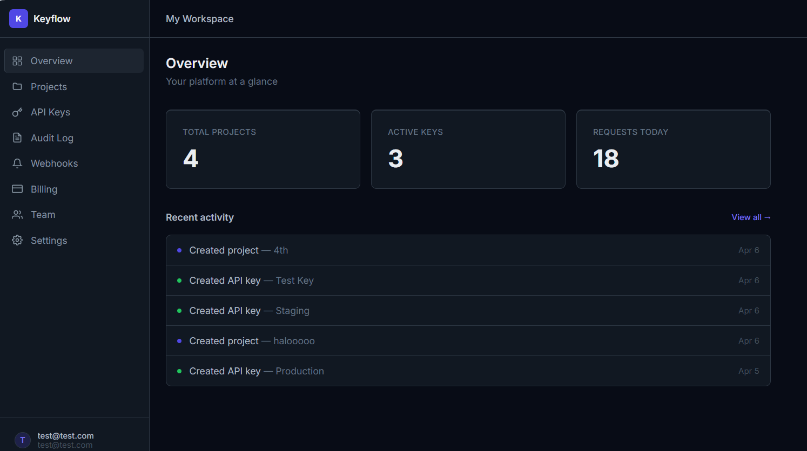
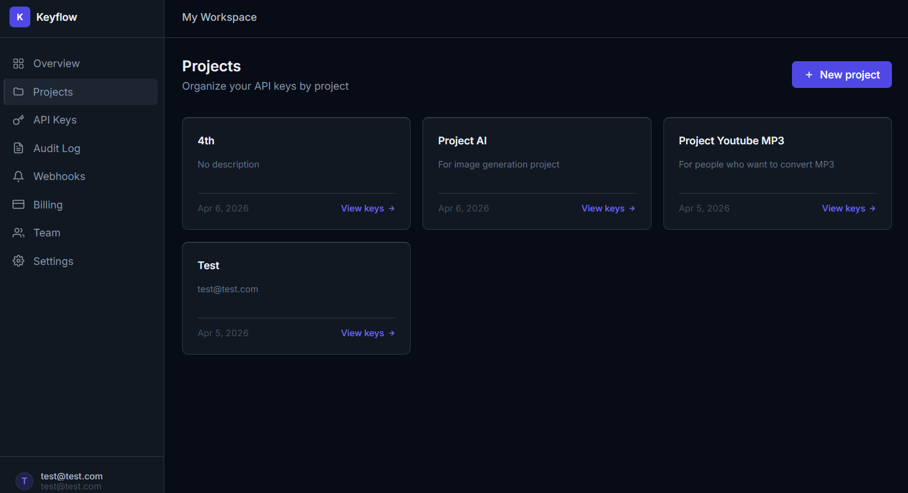
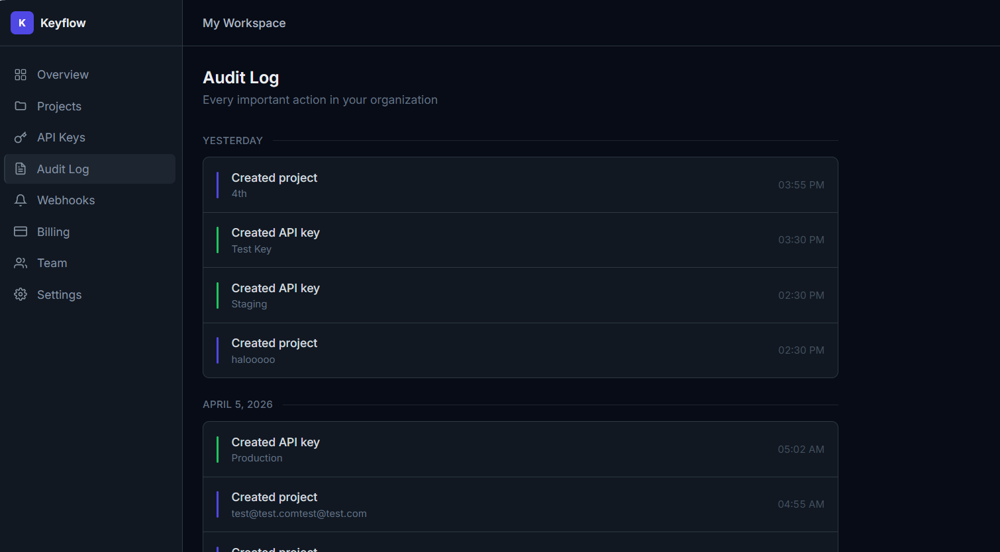
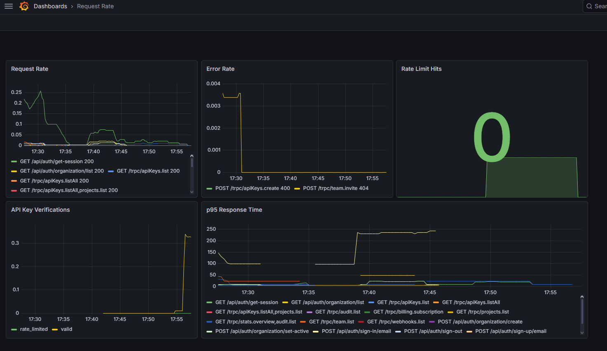
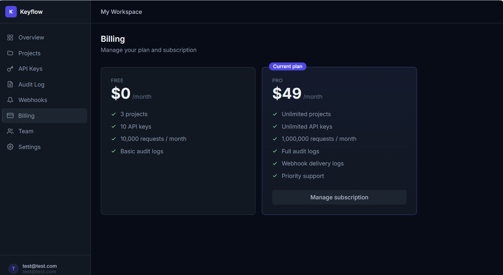
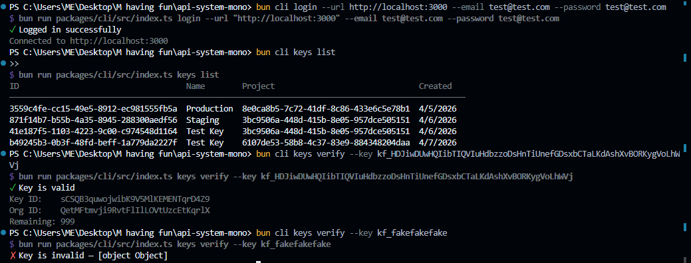

# Keyflow

>A platform for issuing API keys, tracking usage, and managing developer access. Think of it as the infrastructure layer between your API and your users.



---

## The idea

You built an API. Now you need to give users access to it, track how many requests they make, rate limit them, get notified when things happen, and eventually charge them. Keyflow handles all of that so you don't have to build it yourself.

## Screenshots






## Integrate in one line
```bash
npm install @keyflow/sdk
```
```ts
import { KeyflowClient } from '@keyflow/sdk'

const keyflow = new KeyflowClient({ baseUrl: 'https://your-keyflow.com' })

app.use(async (req, res, next) => {
  const result = await keyflow.keys.verify(req.headers['x-api-key'])
  if (!result.valid) return res.status(401).json({ error: result.reason })
  next()
})
```

## How it works
React Dashboard
↓
Hono API (tRPC for dashboard, REST /v1 for SDK and CLI)
↓
Postgres    Redis    MongoDB
↓
Prometheus + Grafana

## Engineering decisions worth knowing

**Rate limiting** uses a sliding window in Redis sorted sets rather than a fixed counter. Fixed counters have a burst vulnerability at reset boundaries — sliding windows don't.

**API key validation** follows a cache-aside pattern. Keys are cached in Redis for 5 minutes so validation is microseconds, not a database roundtrip. If Redis goes down, it falls back to Postgres gracefully.

**Webhook delivery** signs every payload with HMAC-SHA256 and retries failed deliveries with exponential backoff. Every attempt is logged.

**Stripe idempotency** stores every processed event ID. Stripe can deliver the same webhook twice — Keyflow won't process it twice.

**Two MongoDB collections** — usage_logs for every request (high volume, for charts and billing) and audit_logs for user actions (low volume, for accountability). They answer different questions.

## Stack

Bun, Hono, tRPC, Better Auth, Drizzle, PostgreSQL, Redis, MongoDB, Stripe, Prometheus, Grafana, React, Vite, TanStack Router, Turborepo, Biome

## Running locally

You need Bun and Docker.
```bash
git clone https://github.com/riadbettole/keyflow
cd keyflow
bun install
docker compose up -d
cp apps/api/.env.example apps/api/.env
bun db:push
bun dev
```

Dashboard at localhost:5173, API at localhost:3000, Grafana at localhost:3001.

## CLI
```bash
keyflow login --url https://your-keyflow.com --token your-token
keyflow keys list
keyflow keys verify --key kf_xxx
```


## What's next

Terraform on AWS, usage-based billing metering, email notifications, scoped API key permissions.